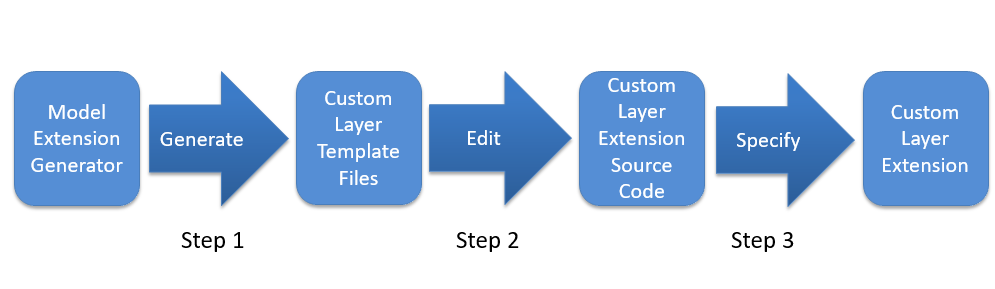

# Project Write-Up

I have checked different models, and for this application Mobilenet SSD running from caffe and from Tensorflow versions runs very well. Model is very stable for this application.

To avoid false positive / false negative on detections, I have added a kalman and Hungarian algorithm filter based.

Command to make a test:
```
python main.py -i resources/Pedestrian_Detect_2_1_1.mp4 -m model/mobilenet-ssd/mobilenet_iter_73000.xml -d CPU -pt 0.65 --wait_ms 60 --class_to_detect 15 | ffmpeg -v warning -f rawvideo -pixel_format bgr24 -video_size 768x432 -framerate 24 -i - http://0.0.0.0:3004/fac.ffm 
```
## 1. Explaining Custom Layers

Custom layers are layers that are not implemented on OpnVino by default. If some layer is needed but not supported, you can create your implementation of that layer, as a custom layer.

### 1.1. Potential reasons for handling custom layers

They are a lot of different architectures, it is common to use different layers on different network topologies. New architectures are continuously being presented and, each architecture normally uses a combination of different layers.

It is a possibility that some new layers are or not implemented on OpenVino toolkit. If we are trying to use some network architecture, we need to have implemented all layers on it or implement all that are not implemented by default. Remember that Inference Engine loads the layers from the input IR files. If some layer is not implemented, it gives an error.

You ca see a list of supported layer by OpenVino: [OpenVino Supported Framework Layers](https://docs.openvinotoolkit.org/latest/openvino_docs_MO_DG_prepare_model_Supported_Frameworks_Layers.html "Supported Framework Layers"). Note that every version of OpenVino toolkit adds new custom layers support.

### 1.2. Custom Layer Implementation Workflow:

When implementing a custom layer for your pre-trained model in the Intel® Distribution of OpenVINO™ toolkit, you will need to add extensions to both the Model Optimizer and the Inference Engine.


The Model Optimizer first extracts information from the input model which includes the topology of the model layers along with parameters, input and output format, etc., for each layer. The model is then optimized from the various known characteristics of the layers, interconnects, and data flow which partly comes from the layer operation providing details including the shape of the output for each layer. Finally, the optimized model is output to the model IR files needed by the Inference Engine to run the model.

The Model Optimizer starts with a library of known extractors and operations for each supported model framework which must be extended to use each unknown custom layer. The custom layer extensions needed by the Model Optimizer are:

1. **Custom Layer Extractor:** Identifies the custom layer operation and extracts the parameters for each instance of the custom layer. The layer parameters are stored per instance and used by the layer operation before finally appearing in the output IR.
1. **Custom Layer Operation:** Specifies the attributes that are supported by the custom layer and computes the output shape for each instance of the custom layer from its parameters. 
    
   
### 1.3. Custom Layer Extensions for the Model Optimizer

The following figure shows the basic processing steps for the Model Optimizer highlighting the two necessary custom layer extensions, the Custom Layer Extractor and the Custom Layer Operation.


Each device plugin includes a library of optimized implementations to execute known layer operations which must be extended to execute a custom layer. The custom layer extension is implemented according to the target device:

1. **Custom Layer CPU Extension:** A compiled shared library (.so or .dll binary) needed by the CPU Plugin for executing the custom layer on the CPU.
1. **Custom Layer GPU Extension:** OpenCL source code (.cl) for the custom layer kernel that will be compiled to execute on the GPU along with a layer description file (.xml) needed by the GPU Plugin for the custom layer kernel.


### 1.4. Model Extension Generator

Using answers to interactive questions or a *.json* configuration file, the Model Extension Generator tool generates template source code files for each of the extensions needed by the Model Optimizer and the Inference Engine. To complete the implementation of each extension, the template functions may need to be edited to fill-in details specific to the custom layer or the actual custom layer functionality itself.

The Model Extension Generator is included in the Intel® Distribution of OpenVINO™ toolkit installation and is run using the command (here with the "--help" option):

```
python3 /opt/intel/openvino/deployment_tools/tools/extension_generator/extgen.py new --help
```

The output will appear similar to:
```
usage: You can use any combination of the following arguments:
Arguments to configure extension generation in the interactive mode:
optional arguments:
  -h, --help            show this help message and exit
  --mo-caffe-ext        generate a Model Optimizer Caffe* extractor
  --mo-mxnet-ext        generate a Model Optimizer MXNet* extractor
  --mo-tf-ext           generate a Model Optimizer TensorFlow* extractor
  --mo-op               generate a Model Optimizer operation
  --ie-cpu-ext          generate an Inference Engine CPU extension
  --ie-gpu-ext          generate an Inference Engine GPU extension
  --output_dir OUTPUT_DIR
                        set an output directory. If not specified, the current
                        directory is used by default.
```

The available command-line arguments are used to specify which extension(s) to generate templates for the Model Optimizer or Inference Engine. The generated extension files for each argument will appear starting from the top of the output directory as follows:

| Command-line Argument  | Output Directory Location |
| ------------- |:-------------:|
| --mo-caffe-ext | user_mo_extensions/front/caffe |
| --mo-mxnet-ext | user_mo_extensions/front/mxnet |
| --mo-tf-ext | user_mo_extensions/front/tf |
| --mo-op | er_mo_extensions/ops |
| --ie-cpu-ext | user_ie_extensions/cpu |
| --ie-gpu-ext | user_ie_extensions/gpu | 

### 1.5. Extension Workflow

The workflow for each generated extension follows the same basic steps:



1. **Step 1. _Generate_:** Use the Model Extension Generator to generate the Custom Layer Template Files.

1. **Step 2. _Edit_:** Edit: Edit the Custom Layer Template Files as necessary to create the specialized Custom Layer Extension Source Code.

1. **Step 3. _Specify_:**  Specify the custom layer extension locations to be used by the Model Optimizer or Inference Engine.

You can find specific information for each supported Framework on [Information about custom layers](https://docs.openvinotoolkit.org/latest/openvino_docs_HOWTO_Custom_Layers_Guide.html) or a practical tutorial on [OpenVINO Custom Layer Tutorials for Linux and Windows](https://github.com/david-drew/OpenVINO-Custom-Layers)

## 2. Comparing Model Performance

My method(s) to compare models before and after conversion to Intermediate Representations
were testing different parameters for 50 iters on each framework (OpenVino and Caffe).

### 2.1 Hardware

I have compiled my own intel-caffe and nvcaffe versions of caffe to make this comparisions on the following machine.

CPU:  Intel(R) Core(TM) i5-7400 CPU @ 3.00GHz

GPU:  GeForce GTX 1050 Ti

RAM:  8Gb

### 2.2 Frameworks

I have used caffe standard command to test caffe model and openvino benchmark_app to test inference times. I have taken each test for 50 times to make a test after system is not in a transition status.

**Note** I recommend to take result times as informative to learn differences between nvidia caffe and intel caffe versions, because caffe framework has a version made from NVidia and another version made from Intel, forked from original caffe version.

Each one of them has different optimization levels, libraries, etc, and it is impossible to be objective with these comparations.

Then, one to one comparisions made using another framework like Tensorflow could be better, but I have selected this one for the project (this file  will be updated with tensorflow results).

I noticed that nvidia version and intel version are not compatibles between them, and I noticed that all versions has differences with OpenCV inference version. 

These speeds are for inference only

### 2.3. Differences between model pre and post conversion

| Framework     | MODEL        | Iters | FPS     | mS           | Post Convertion | Size (bytes)|
| ------------- |------------- |------ | ---     |------------- |:-------------:|:-------------:|
| Caffe-nvidia  | Mobilenet SSD| 50    | 6,40    | 156.083 mS   |------------- |23306119|
| Caffe-intel   |Mobilenet SSD | 50    | 63.299  | 15.7979 mS   |------------- |23306119|
| OpenVINO      |Mobilenet SSD | 50    |120.93   | 8,2692 mS    |------------- |23133788|

You can see that the inference time of the model pre and post conversion was speeded up about 20 times from NVCaffe to OpenVino and about 2 times from intel fork of caffe with MKL. In order to make a accuracy comparision on a real application, we will test for a batch of final and representatives images, and check that every image on intel OpenVINO framework and on caffe framework, as I have not final images I cannot check for them.

## 3. Assess Model Use Cases

Some of the potential use cases of the people counter app are people analitycs, in different scenarios.

THe basi scenatio is people analitycs on retail, and with very few modifications, we can make very interesting software for different use cases:

1. `Heatmaps` Code is easily extensible to make a heatmap of locations where are working
1. `Intrusion detection and registration` We can use this system to detect peoples on forbidden sites, and emit an alarm, using MQTT requests
1. `People counting on public spaces` It is interesting for gouvernments, to know people analytics and behavior, as example, to count peoples on public spaces
1. `People tracking` This is usefull to understand the trajectory of peoples. Now I'm using a kalman filter and a Hungarian algorithm to make one to one association, but it could be improved making people recognition and re-identification
1. `Measure social distancing` It is easily extensible to measure distance between peoples, very usefull on coronavirus time.
1. `Running and speed meter`. We can measure mean speed on low trajectories, to know the speed of runners.

As we are detecting on the edge, it is not neccesary to have a very wide bandwidth nor strong internet connection. We compute locally and need only to send little few data normally.


## 4. Assess Effects on End User Needs

Lighting, model accuracy, and camera focal length/image size have different effects on a
deployed edge model.

The potential effects of each of these are as follows:

Using modern techniques based on deep learning, lighting, model accuracy, camera focal lenght and image size are not a big problem, a very interesting property of deep neural networks are that they can learn very complex patterns, then if networks are trained on some generic dataset, we can make inferences without problems moreover **model accuracy**, **Lighting changes**, **focal length** and **image size**.

### 4.1. Lighting changes
If the network was trained in sufficiently representative data and with changes in luminosity, changing lighting will not be a problem. Obviously, talking in terms of normal changes. Each camera can have different sensitivity for some channel or lighting sensitivity, then, different changes could receive the image in a different way. Moreover that, normally it is not a problem.

**Extremme cases**. If image is not so lighting as camera expects, it could be noise and accuracy could be decreased.

### 4.2. Focal length
Again, as deep neural networks are generalists, if networks are trained on variety of images with changes between them, it will not be a problem.

**Extremme cases**. If image is out ouf focus due to focal lenght changes, network can receive a fuzzy image, and some times this fuzzy image is could not be sufficient to detect objects, and accuracy could be decreased.

### 4.3. Image size
In pre training stage, we crops and modify the image to make his shape to be similar to the input shape of the network. Due to that, normally we have a lot of information that is not so important, and normally we make a downsampling of the image. If we change input size, normally we will not have mayor problems.

**Extremme cases**. If image is too little, maybe post processing stage make an image bigger making a upsampling from the original image, in this case, probably accuracy will be decreased.

### 4.4. Model accuracy
For model accuracy, if we only convert the weights, we will not have problems nor important accuracy decreases, because we are only making another representation to speed up the inference. Also, depending on some hardware, we could need to quantize original network, changing original resolution of weights and we can decrease accuraccy slightly (as example, from FP32 to FP16). Normally it is not important but we must could run accuracy checks. In all cases accuracy checks is a good check for final system.

**Other cases**. In some cases, we do Post-Training Optimization to speed up model, and we need to check that accuracy is as high as we need, but we are not doing it. Also, I have mentioned how does previous items could affect accuracy on extremme cases.
